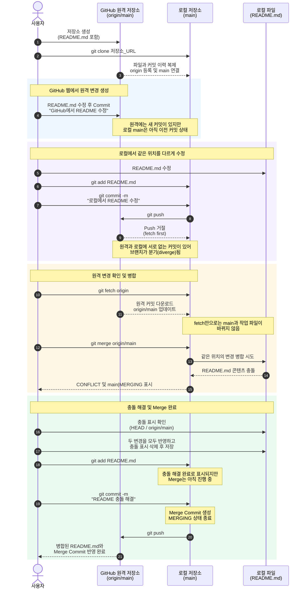
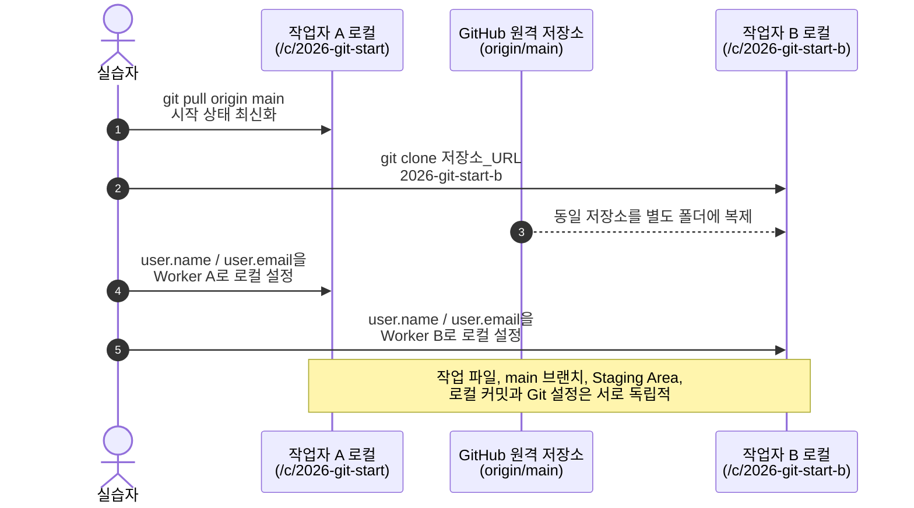
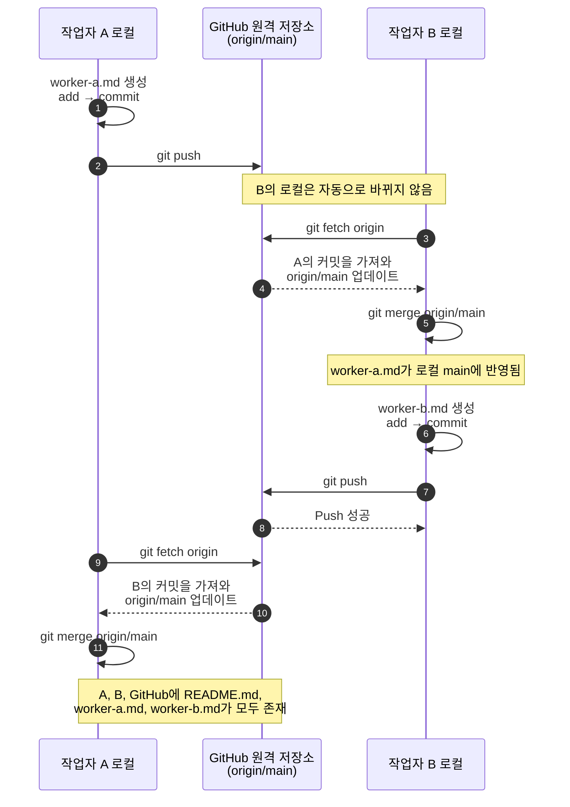
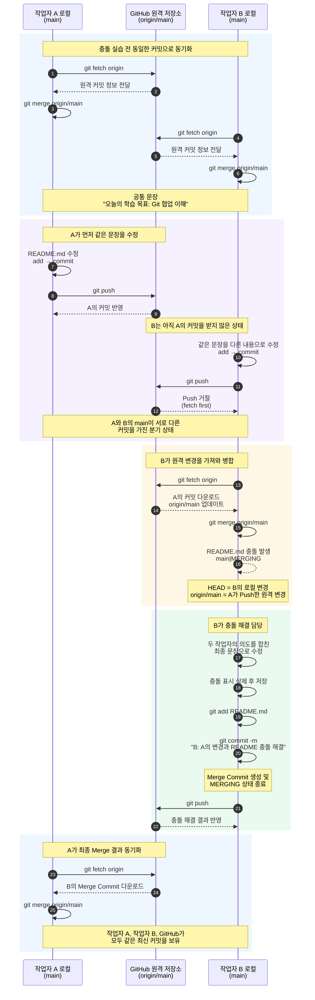

# 2026-git-start
hi
melong
GitHub 웹에서 추가한 내용입니다.

GitHub 웹에서 추가한 내용입니다.

오늘의 학습 목표: 작업자 A·B의 Git 협업 및 Merge 충돌 해결

# Git Merge 충돌 해결 실습 시퀀스 다이어그램

> 대상 자료  
> - `4-2_1단계__GitHub와_로컬_저장소의_Merge_충돌_해결_실습.pdf`
> - `4-2_2단계_작업자_AB의_Fetch_Merge_및_충돌_해결.pdf`

## 1단계: GitHub 웹과 로컬 저장소의 충돌 해결

GitHub 웹과 로컬에서 `README.md`의 같은 위치를 서로 다르게 수정한 뒤, 로컬에서 원격 변경을 가져와 충돌을 해결하는 과정이다.



## 2단계: 작업자 A·B 협업 환경 구성

같은 GitHub 저장소를 두 폴더에 각각 Clone하여 서로 독립적인 작업자 A와 B의 로컬 저장소를 구성한다.



## 2단계 - 1차: 충돌 없는 협업

두 작업자가 서로 다른 파일을 수정하면 Git이 변경을 자동으로 병합할 수 있다.



## 2단계 - 2차: 같은 파일 수정과 충돌 해결

A와 B가 동일한 공통 커밋에서 `README.md`의 같은 문장을 다르게 수정한다. A가 먼저 Push한 뒤 B가 원격 변경을 병합하면서 충돌을 해결한다.



## 핵심 명령 흐름

```text
작업 시작: git fetch origin → git merge origin/main
작업 저장: 파일 수정 → git add → git commit → git push
충돌 해결: 충돌 파일 수정 → git add → git commit → git push
```

- `git fetch origin`: 원격 커밋 정보를 가져와 `origin/main`을 갱신하지만, 현재 `main`과 작업 파일은 바로 바꾸지 않는다.
- `git merge origin/main`: 원격 추적 브랜치의 변경을 현재 로컬 `main`에 병합한다.
- 충돌은 Merge를 실행한 작업자의 로컬 저장소에서 발생하며, 해당 작업자가 해결한다.
- 해결 결과를 Push한 후 다른 작업자도 `fetch → merge`로 최종 결과를 동기화한다.
